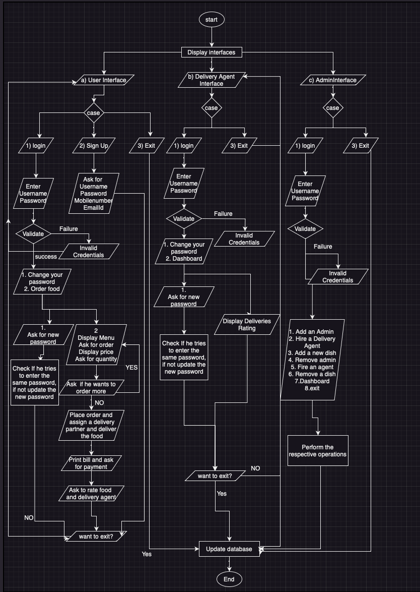

## Getting Started
 
Welcome to the HealthyDOOR:) . It is a food delivery app which delivers the best hygenic food to your place. 
 
## Folder Structure 
 
The workspace contains two folders by default, where: 
 
- `src`: the folder to maintain sources 
- `lib`: the folder to maintain dependencies 
 
Meanwhile, the compiled output files will be generated in the `bin` folder by default. 
 
 
## Dependency Management 
 

# INTERFACES USED IN THE APP:
## a) Customer    b) Delivery Agent    c) Admin 

 
 

 
The User will be asked to choose the interface. 
 
 

# a) Customer
- Now if the user choose "a", Then the meaning is he is a customer. So we redirect the customer to the "Customer Interface Page" 
    - After choosing "a", He will be given 3 Options
        1. Login
        2. Sign Up
        3. Exit 

         
 

 
 

        - If he choose '1' it means that customer wants to login to his account. So we redirect the customer to the "Customer Login Page"
            - So customer will be asked to enter his credentials (username and password) to login
            ### VALIDATION STEP:
                - If the customer's entered username and password already appear in the customer login table inside the database, it is likely that the person has already registered using those details. We will allow him to properly log in.
                - If the customer's entered username and password already does not appear in the customer login table inside the database, it is likely that the person has not registered using those details. We will not allow him to log in.
             - After successfull login the customer will be provided with 2 options
                1. Change your password
                2. Order food
 
 

 
 
                - If the customer choose the option '1', Then customer will be asked to enter the new password. So we redirect the customer to the "Customer Password Change Page"
                    ### VALIDATION STEP:
                    - If the customer enters the same password again in the new password option, then the customer will be given a error message.
                    - The customer will successfully change the password if he or she enters a different one, And the password will be updated in the database.

 
 

 
 

 
 

 
 

                - If the customer choose the option '2', then it means that he wants to order some food. So we redirect the customer to the "Ordering Page"
                    - Customer will be displayed with the HealthyDOOR food menu from the database.

 
 

 
 

                    - Now we will ask the customer to order the food from the menu.
                    - Then we will ask the quantity of the food customer is ordering.
                    - We will ask the customer whether he wants to place any additional orders.
                        - If customer say "Yes" then will again repeat the second and third step (ask for the dish and the quantity).
                        - If customer say "No", then will start the following options:
                            - We will place the order.
                            - We will start preparing the order.
                            - We will assign a delivery agent from our company.
                            - We will deliver the food successfully.

 
 

 
     

                    - After the food is delivered successfully, We redirect the customer to the "Payment Page". We will provide the bill to the customer and provide 3 payment options
                        1. Cash
                        2. Gpay/Phonepe
                        3. Card (This option is unavailable at the movement, we will be working on it.)

                        - If customer choose the option '1', then he will be asked to pay the cash.

 
 

 
 

 
 

 
 

                        - If customer choose option '2', then the customer will be provided with a mobile number, so that customer can pay the amount to that mobile number.

 
 

 
 

                        - If the customer choose option '3', then the customer will be get an error message and redirects to the Payment page.

 
 

 
 

                    - After the payyment is done successfully, we will ask the customer to rate the food he ordered and the delivery agent who has delivered his food.

 
 

 
 

                    - After the Customer rate the food and delivery agent, He will asked about whether he wants to exit.
                        - If the customer say "yes", then the customer will be exited successfully and programs ends.
                        - If the customer say "no", then the customer will be redirected to the "Customer Interface Page".
                    - All the details will be updated in the database.

 
 

 
 

        -  If he choose '2' it means that customer wants to register on our app. So we redirect the customer to the "Customer Registration Page"
            - The Customer will be asked to choose his username, password.
            - The Customer will be asked to enter his mobile number and email id.
            - After entering the details, Customer will be registered successfully. And the details will be added in the database.

 
 

 
 

            - After Registering successfully, he will be asked about whether he wants to exit.
                - If the customer say "yes", then the customer will be exited successfully and programs ends.
                - If the customer say "no", then the customer will be redirected to the "Customer Interface Page".

 
 

 
 

        - If he choose '3' it means that customer wants to Exit from the app. So we will end the program right away.
 
 

 
 

 
 

# b) Delivery Agent
- Now if the user choose "b", Then the meaning is he is a Delivery Agent who works in our company. So we redirect the Agent to the "Agent Interface Page" 
    - After choosing "b", He will be given 2 Options
        1. Login
        2. Exit 

 
 

 
 

        - If he choose '1' it means that Agent wants to login to his account. So we redirect the Agent to the "Agent Login Page"
            - So Agent will be asked to enter his credentials (username and password) to login
            ### VALIDATION STEP:
                - If the Agent's entered username and password already appear in the Agent login table inside the database, it is likely that the person has already registered using those details. We will allow him to properly log in.
                - If the Agent's entered username and password already does not appear in the Agent login table inside the database, it is likely that the person has not registered using those details. We will not allow him to log in.

 
 

 
 

             - After successfull login the Agent will be provided with 2 options
                1. Change your password
                2. Your Dashboard
                
                - If the customer choose the option '1', Then agent will be asked to enter the new password. So we redirect the agent to the "Agent Password Change Page"
                    ### VALIDATION STEP:
                    - If the agent enters the same password again in the new password option, then the agent will be given a error message.
                    - The agent will successfully change the password if he or she enters a different one, And the password will be updated in the database.
                

 
 

 
 

 
 

 
 

                - If the agent choose the option '2', then it means that he wants view his dashboard. So we redirect the agent to the "Dashboard Page"
                    - Agent will be displayed with the deliveries, which the agent has delivered. we will fetch these details from the database.
                    - Agent will be displayed with the Overall Ratings, which are given by the customers for his delivery. we will fetch these details from the database.

 
 

 
 

        - If he choose '2' it means that Agent wants to Exit from the app. So we will end the program right away.

 
 

 
 

 
 

# c) Admin                 
- Now if the user choose "c", Then the meaning is he is a Admin who runs the company. So we redirect the Admin to the "Admin Interface Page" 
    - After choosing "c", He will be given 2 Options
        1. Login
        2. Exit 
 
 

 
 

        - If he choose '1' it means that admin wants to login to his account. So we redirect the admin to the "Admin Login Page"
            - So admin will be asked to enter his credentials (username and password) to login
            ### VALIDATION STEP:
                - If the Admin's entered username and password already appear in the Admin login table inside the database, it is likely that the person has already registered using those details. We will allow him to properly log in.
                - If the Admin's entered username and password already does not appear in the Admin login table inside the database, it is likely that the person has not registered using those details. We will not allow him to log in.

 
 

 
 

 
 

 
 

             - After successfull login the Admin will be provided with 8 options
                1. Add an Admin
                2. Hire a Delivery Agent
                3. Add a new dish
                4. Remove an Admin
                5. Fire a Delivery Agent
                6. Remove a dish
                7. Display Dashboard
                8. Exit

 
 

 
 

                - If the admin choose the option '1' then the admin will be redirected to the "Add Admin Page"
                    - Admin will be asked to enter the details of the new admin (username and password).
                    - After entering the details, the admin will be added successfully to the database.
                    - Then the admin will be redirected back to the "Admin Operations Page"

 
 

 
 

                
                - If the admin choose the option '2' then the admin will be redirected to the "Hiring an Employee Page"
                    - Admin will be asked to enter the details of the new delivery agent (username, password, mobile number, email id, salary, agent_id).
                        ### VALIDATION STEP:
                        - If the Admin's enter the agent id which is already assigned to a agent then we throw an error.
                        - If the Admin's enter the agent id which is not assigned to any agent then we procced further.
                    - After entering the details, the delivery agent will be hired successfully and gets added to the database.
                    - Then the admin will be redirected back to the "Admin Operations Page"

 
 

 
 

                
                - If the admin choose the option '3' then the admin will be redirected to the "Add a new Dish Page"
                    - Admin will be asked to enter the details of the new dish (dish name, description and price of the dish).
                    - After entering the details, the dish will be added successfully to the database.
                    - Then the admin will be redirected back to the "Admin Operations Page"

 
 

 
 

                
                - If the admin choose the option '4' then the admin will be redirected to the "Remove Admin Page"
                    - Admin will be asked to enter the username of the admin.
                    - After entering the username, the admin will be deactivated successfully from the database.
                    - Then the admin will be redirected back to the "Admin Operations Page"

 
 

 
 

                - If the admin choose the option '5' then the admin will be redirected to the "Fire an Employee Page"
                    - Admin will be asked to enter the username of the delivery agent.
                    - After entering the username, the admin will be fired successfully from the database.
                    - Then the admin will be redirected back to the "Admin Operations Page"

 
 

 
 

                - If the admin choose the option '6' then the admin will be redirected to the "Remove a Dish Page"
                    - Admin will be asked to enter the details of the dish (dish name).
                    - After entering the details, the dish will be removed successfully from the database.
                    - Then the admin will be redirected back to the "Admin Operations Page"
                
 
 

 
 

                - If the admin choose the option '7' then the admin will be redirected to the "Dashboard Page"
                    - Admin will be provided with 2 options
                        1. Detailed Information
                        2. Analytics

                        - If admin choose '1' then:
                            - He can see the details of all Employees.
                            - He can see Employee performance metrics.
                            - He can see total orders placed.

 
 

 
 

 
 

 
 

                        - If admin choose '2' then:
                            - He can see the total number of orders.
                            - He can see the total revenue generated.
                            - He can see each item of the menu and the number of times it got ordered.
                            - Then the admin will be redirected back to the "Admin Operations Page"

 
 

 
 

                - If he choose '8' it means that admin wants to Exit from the app. So we will end the program right away.

 
 

 
 

 
 

FlowChart:
 
 

